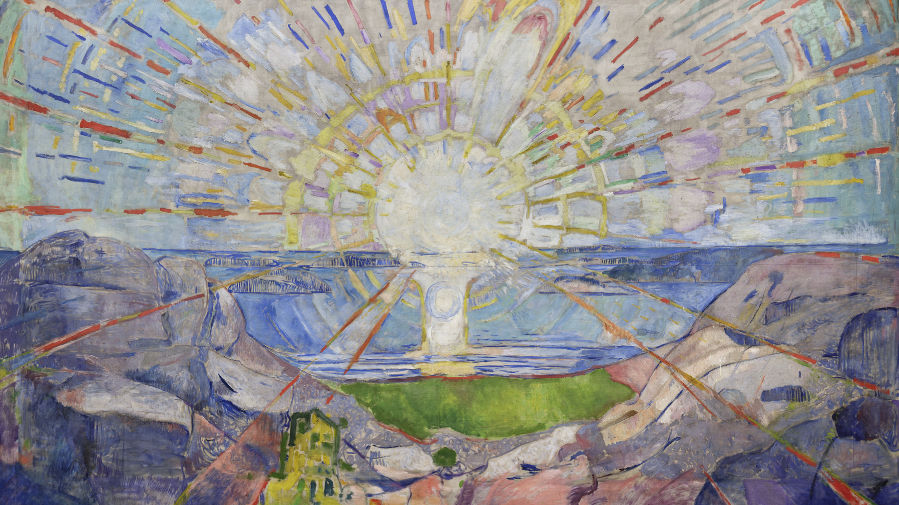

# Munch Solen Dark — an Omarchy theme

A dark Omarchy theme built from Edvard Munch’s Aula mural *The Sun* (*Solen*, 1911). The painting is the light; the chrome is the rock shadow: cool indigo clefts, cadmium rays for focus, straw halo for type. Sibling of [Munch Solen Light](https://github.com/mscurtescu/omarchy-munch-solen-light-theme).



## Install

```bash
omarchy theme install https://github.com/mscurtescu/omarchy-munch-solen-dark-theme.git
```

Note: `omarchy theme install` stages git-cloned themes without `*.lua`, so the
solar border in `hyprland.lua` is reported as ignored on that path. To get the
border, link a local checkout instead and apply:

```bash
ln -sfn "$(pwd)" ~/.config/omarchy/themes/munch-solen-dark
omarchy theme set munch-solen-dark
```

## Palette

| Role | Colour | From the mural |
| --- | --- | --- |
| background | `#1A1E32` | Rock cleft |
| surface | `#32364A` | Lifted indigo |
| selection | `#32364A` | Same well |
| comment / muted | `#9D8669` | Warm earth |
| foreground | `#EFE2BF` | Straw halo |
| bright foreground | `#F2E8C9` | Sun-side paper |
| **accent** | `#C44838` | **Cadmium ray** |
| red | `#B84838` | Ray orange |
| orange | `#C85A38` | Inner spoke |
| yellow | `#C8B040` | Chrome yellow |
| green | `#6A8144` | Field / lichen |
| cyan | `#6F798A` | Water |
| blue | `#6A7A92` | Far shore |
| magenta | `#795669` | Violet rock |
| brown | `#7A6044` | Umber cleft |

Semantic roles in `colors.toml` are the source of truth; `color0`–`color15` mirror them. Terminals, Neovim (Aether), btop, Helix, and Chromium are generated from that file on `omarchy theme set`.

## Wallpaper

`backgrounds/1-solen.jpg` is a 3840×2238 sRGB JPEG of the official University of Oslo reproduction (museum frame cropped, quality 92). Cover-scaling on a 3:2 panel crops the sides and keeps the sun.

This image is **not** MIT. See [License](#license).

## License

Original theme files (configs, this README) are MIT. See `LICENSE`.

The wallpaper and `preview.png` are a reproduction of Edvard Munch, *The Sun* (*Solen*), 1911, University of Oslo Aula (UiO.K.01399, Woll 970). Photograph © Universitetet i Oslo, [CC BY-NC-SA 4.0](https://creativecommons.org/licenses/by-nc-sa/4.0/). Full credit: `backgrounds/NOTICE`.

## Credits

**Wallpaper** — Edvard Munch, *The Sun* (*Solen*), 1911. Photograph © Universitetet i Oslo. [Terms](https://www.uio.no/om/kultur/kunstsamlingen/kopirett.html).

**Inspiration (not the file)** — [@impression_ists, 2026-09-06](https://x.com/impression_ists/status/2096576469157699587).

**Palette roles** — [@MeditateColor, 2026-09-06](https://x.com/MeditateColor/status/2096619280376938824). Hexes were retargeted onto the UiO scan; their annotated graphics are not shipped.
