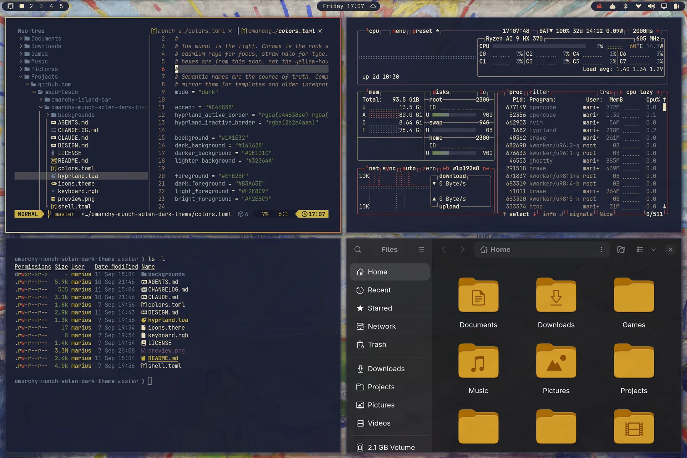
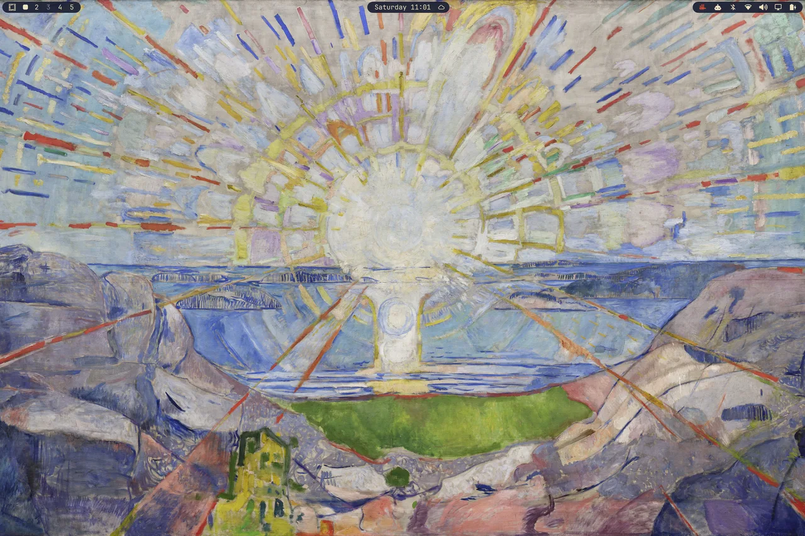
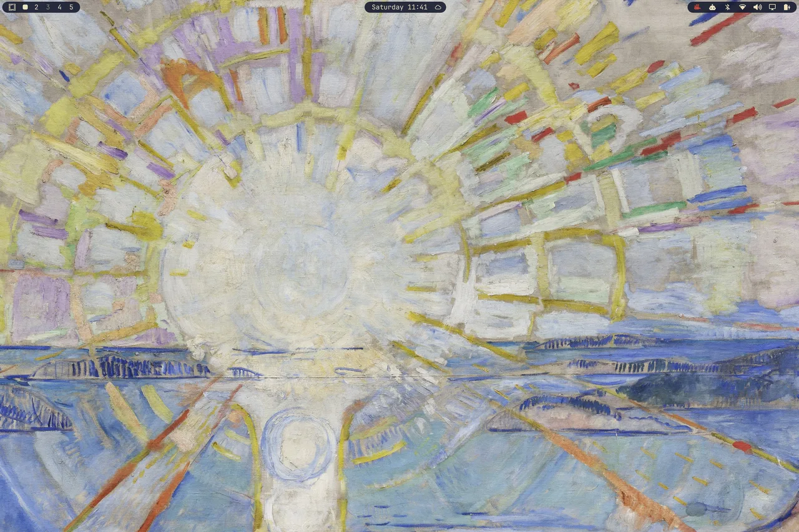
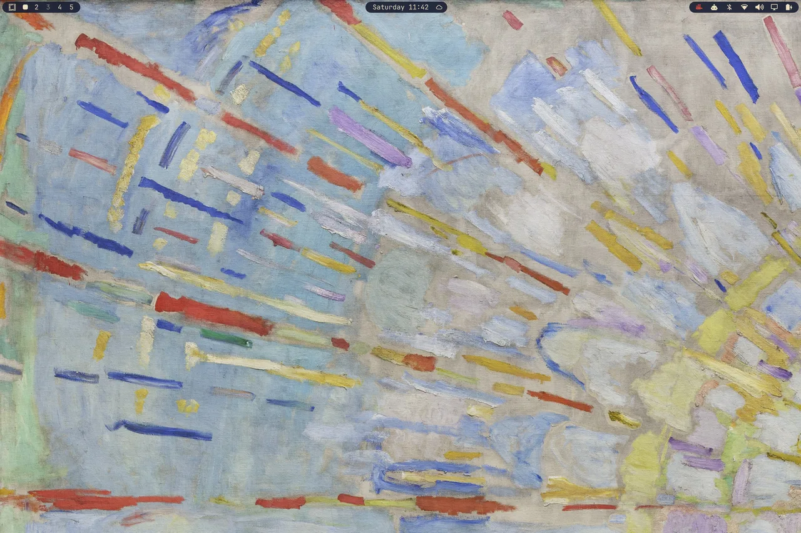

# Munch Solen Dark — an Omarchy theme

A dark Omarchy theme built from Edvard Munch’s Aula mural *The Sun* (*Solen*, 1911). The painting is the light; the chrome is the rock shadow: cool indigo clefts, cadmium rays for focus, straw halo for type. Sibling of [Munch Solen Light](https://github.com/mscurtescu/omarchy-munch-solen-light-theme). Design notes: [DESIGN.md](DESIGN.md).



## Install

```bash
omarchy theme install https://github.com/mscurtescu/omarchy-munch-solen-dark-theme.git
```

## Palette

| Role | Colour | From the mural |
| --- | --- | --- |
| background | `#1A1E32` | Rock cleft |
| surface | `#32364A` | Lifted indigo |
| selection | `#32364A` | Same well |
| comment / muted | `#9D8669` | Warm earth |
| foreground | `#EFE2BF` | Straw halo |
| bright foreground | `#F2E8C9` | Sun-side paper |
| **accent** | `#C44838` | **Cadmium ray** |
| red | `#B84838` | Ray orange |
| orange | `#C85A38` | Inner spoke |
| yellow | `#C8B040` | Chrome yellow |
| green | `#6A8144` | Field / lichen |
| cyan | `#6F798A` | Water |
| blue | `#6A7A92` | Far shore |
| magenta | `#795669` | Violet rock |
| brown | `#7A6044` | Umber cleft |

Semantic roles in `colors.toml` are the source of truth; `color0`–`color15` mirror them. Terminals, Neovim (Aether), btop, Helix, and Chromium are generated from that file on `omarchy theme set`.

## Wallpaper



`backgrounds/1-solen.jpg` is the official University of Oslo reproduction (museum frame cropped, quality 92). Cover-scaling on a 3:2 panel crops the sides and keeps the sun. `backgrounds/2-solen-disk.jpg` (sun-disk close-up) and `backgrounds/3-solen-rays.jpg` (ray texture) are detail crops of the same photograph — cycle with `omarchy theme bg next`. Above: empty desktop with the Island Bar on the mural.

Empty desktops on the detail crops:




This image is **not** MIT — see [Licensing](DESIGN.md#licensing-split).

## See also

- **Sibling theme:** [Munch Solen Light](https://github.com/mscurtescu/omarchy-munch-solen-light-theme) — same mural, straw-paper light variant.
- **Island Bar:** [mscurtescu/omarchy-island-bar](https://github.com/mscurtescu/omarchy-island-bar) (`mscurtescu.island-bar`) — the bar replacement visible in the screenshots above: stock bar as three rounded islands on a transparent strip. Install with `omarchy plugin add https://github.com/mscurtescu/omarchy-island-bar.git --enable`.

## License

Original theme files (configs, this README) are MIT. See `LICENSE`. The wallpapers are reproductions of Edvard Munch, *The Sun* (*Solen*), 1911 — photograph © Universitetet i Oslo, [CC BY-NC-SA 4.0](https://creativecommons.org/licenses/by-nc-sa/4.0/); full credit in `backgrounds/NOTICE`. `preview.webp` is a desktop screenshot of the applied theme. Details: [DESIGN.md#licensing-split](DESIGN.md#licensing-split), [DESIGN.md#credits](DESIGN.md#credits).

Issues for both Munch Solen themes live here (shared beads tracker).
